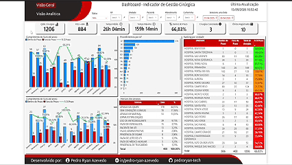
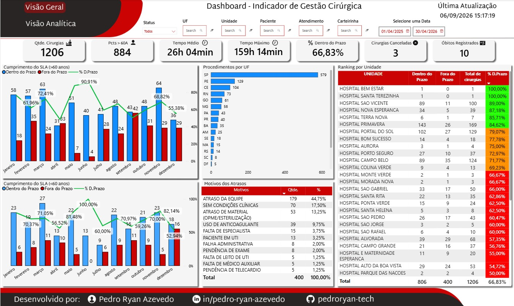
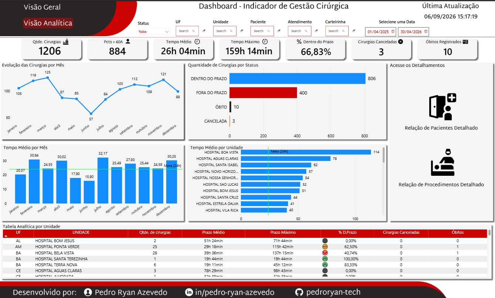
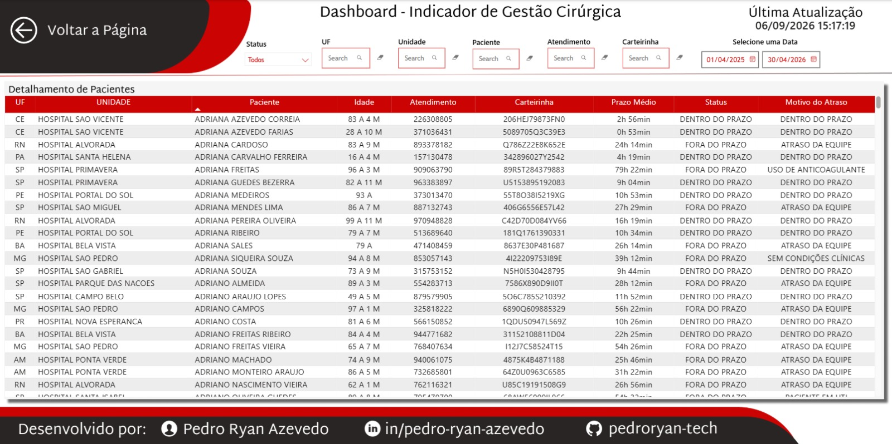
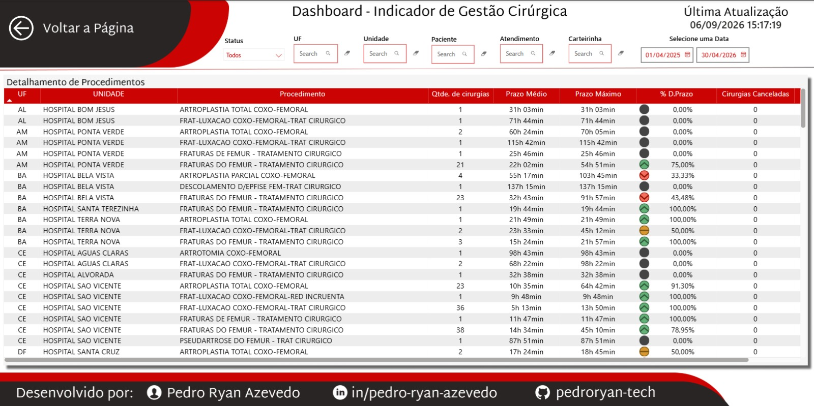

# 📊 Dashboard de Gestão Cirúrgica




Dashboard desenvolvido em **Power BI** para análise e acompanhamento de procedimentos cirúrgicos, com foco em indicadores de desempenho, cumprimento de prazos, tempo de realização, distribuição por unidade e identificação de oportunidades de melhoria.

---

## 🎯 Objetivo

O projeto tem como objetivo transformar dados operacionais em informações visuais que apoiem o acompanhamento da operação e a tomada de decisão.

A solução foi estruturada para permitir análises gerenciais e operacionais, facilitando a identificação de desvios, gargalos e oportunidades de melhoria.

Entre os principais pontos analisados estão:

- Volume de procedimentos realizados;
- Pacientes com idade superior a 60 anos (casos de risco);
- Tempo médio e máximo entre autorização e realização;
- Cumprimento do prazo estabelecido (SLA);
- Procedimentos cancelados;
- Óbitos registrados;
- Distribuição dos procedimentos por UF e unidade;
- Principais motivos de atraso;
- Evolução dos indicadores ao longo do tempo;
- Detalhamento de pacientes e procedimentos.

---

## 📌 Principais Indicadores

O dashboard apresenta indicadores como:

- **Quantidade de cirurgias**
- **Pacientes > 60 anos**
- **Tempo médio até a realização**
- **Tempo máximo até a realização**
- **Percentual de procedimentos dentro do prazo**
- **Procedimentos cancelados**
- **Óbitos registrados**

---

## 📈 Estrutura do Dashboard

O projeto é dividido em quatro páginas principais.

### 1. Visão Geral

Apresenta uma visão executiva dos principais indicadores e permite uma leitura rápida do cenário geral.

Principais análises:

- Procedimentos por UF;
- Motivos dos atrasos;
- Ranking de desempenho por unidade;
- Cumprimento do SLA por mês para pacientes com mais de 60 anos;
- Cumprimento do SLA por mês para pacientes com menos de 60 anos;
- Indicadores gerais de volume, prazo, cancelamentos e óbitos.



### 2. Visão Analítica

Página voltada para uma análise mais detalhada do comportamento dos indicadores.

Principais análises:

- Evolução da quantidade de cirurgias por mês;
- Quantidade de cirurgias por status;
- Tempo médio por mês;
- Tempo médio por unidade;
- Tabela analítica por unidade;
- Acesso às páginas de detalhamento.



### 3. Detalhamento de Pacientes

Página destinada à consulta individual dos registros, permitindo localizar pacientes por meio dos filtros disponíveis.

Informações apresentadas:

- UF;
- Unidade;
- Paciente;
- Idade;
- Atendimento;
- Carteirinha;
- Prazo médio;
- Status;
- Motivo do atraso.



### 4. Detalhamento de Procedimentos

Página destinada à análise dos procedimentos realizados, permitindo avaliar volume e indicadores de desempenho por procedimento e unidade.

Informações apresentadas:

- UF;
- Unidade;
- Procedimento;
- Quantidade de cirurgias;
- Prazo médio;
- Prazo máximo;
- Percentual dentro do prazo;
- Cirurgias canceladas.



---

## 🔎 Filtros e Interatividade

O dashboard possui filtros que permitem realizar análises específicas de acordo com o contexto desejado.

Entre os filtros disponíveis estão:

- Status;
- UF;
- Unidade;
- Paciente;
- Atendimento;
- Carteirinha;
- Data.

A navegação entre as páginas de análise e detalhamento também foi estruturada para facilitar a exploração dos dados.

---

## 🛠️ Tecnologias Utilizadas

- **Power BI**
- **DAX**
- **Power Query**
- **Microsoft Excel**
- **Figma**
- **Git**
- **GitHub**

---

## 🔄 Tratamento e Modelagem dos Dados

Os dados foram tratados e preparados para análise utilizando **Power Query** e **Microsoft Excel**.

Entre os principais procedimentos realizados estão:

- Limpeza e padronização dos dados;
- Tratamento de valores nulos;
- Padronização de categorias;
- Tratamento e transformação de campos;
- Criação de campos derivados;
- Preparação dos dados para análise temporal;
- Estruturação das informações para utilização no Power BI;
- Criação de medidas e indicadores utilizando **DAX**.

A modelagem foi estruturada para permitir análises temporais, operacionais e gerenciais.

---

## 🎨 Design e Experiência

A interface do dashboard foi planejada previamente no **Figma**, permitindo definir a estrutura visual, disposição dos indicadores, gráficos, filtros e elementos de navegação antes da implementação no Power BI.

O projeto buscou combinar:

- Clareza na apresentação dos indicadores;
- Organização das informações;
- Navegação intuitiva;
- Padronização visual;
- Facilidade de análise.

---

## 🔐 Anonimização dos Dados

Para disponibilização pública do projeto, a base utilizada foi **anonimizada e tratada**.

Foram alterados, substituídos ou removidos identificadores e informações que poderiam estar associados aos dados originais, incluindo:

- Identificação de pacientes;
- Números de atendimento;
- Carteirinhas;
- Unidades;
- Filiais;
- Setores;
- Informações relacionadas aos procedimentos;
- Datas e idades utilizadas na base pública.

A versão disponibilizada neste repositório possui finalidade exclusivamente **demonstrativa e de portfólio**, preservando a estrutura necessária para reprodução das análises apresentadas no dashboard.

---

## 📂 Estrutura do Repositório

```text
Dashboard_PowerBI_Gestao_Cirurgica/
│
├── Dashboard/
│   └── Dashboard_Gestao_Cirurgica.pbix
│
├── Dataset/
│   └── Base_Cirúrgica.xlsx
│
├── Imagens/
│   ├── layout-figma-pagina-1.png
│   ├── layout-figma-pagina-2.png
│   ├── layout-figma-pagina-3.png
│   ├── layout-figma-pagina-4.png
│   ├── pagina-1.jpeg
│   ├── pagina-2.jpeg
│   ├── pagina-3.jpeg
│   └── pagina-4.jpeg
│
├── README.md
├── LICENSE
└── .gitignore
```
---

## 👨‍💻 Autor

**Pedro Ryan Azevedo**

- **GitHub:** [Pedro Ryan Azevedo](https://github.com/pedroryan-tech)
- **LinkedIn:** [Pedro Ryan Azevedo](https://www.linkedin.com/in/pedro-ryan-azevedo)

---

## ⭐ Apoie o Projeto

**Se este projeto foi útil ou interessante para você, deixe uma estrela no repositório!**